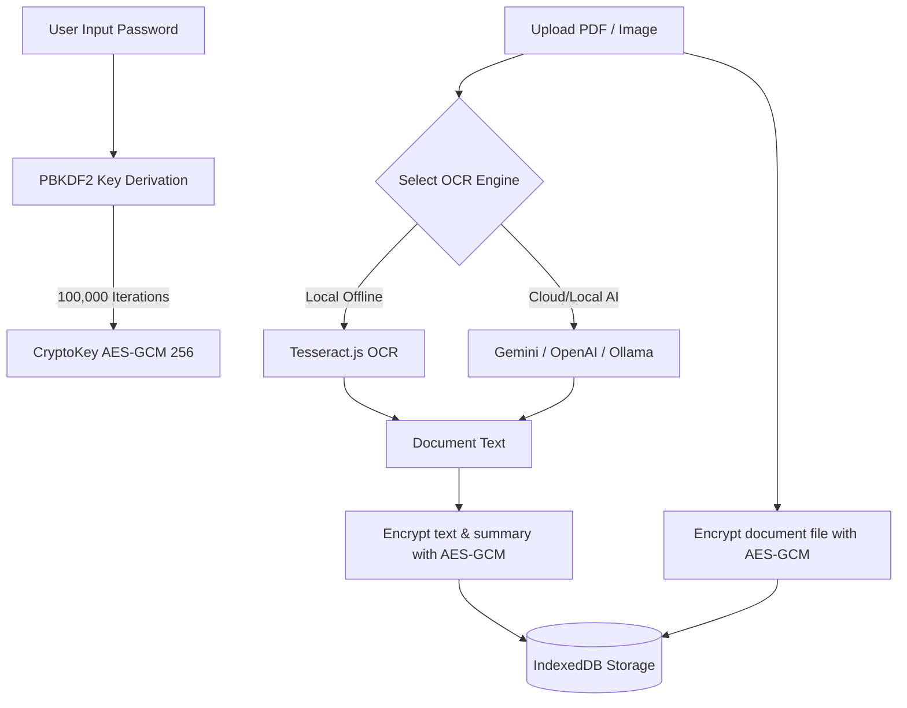

<div align="center">


# 👁️ OcularOCR

**A privacy-first, zero-knowledge local-encrypted document vault & AI-powered OCR suite.**

[](https://nextjs.org/)
[](https://react.dev/)
[](https://tailwindcss.com/)
[](https://opensource.org/licenses/MIT)

</div>

---

## 📖 Overview

**OcularOCR** is a Progressive Web App (PWA) designed to safely store, organize, and perform Optical Character Recognition (OCR) on your sensitive documents. 

Traditional OCR tools require uploading your sensitive documents (invoices, tax forms, IDs) to remote servers in plain text. OcularOCR solves this by introducing a **zero-knowledge local-encrypted vault**. All files and extracted data are encrypted directly in your browser using standard cryptography before being stored in IndexedDB. No plain text data ever leaves your device.

---

## ✨ Core Features

*   **🔒 Zero-Knowledge Encrypted Vault**: All documents, metadata, tags, and AI summaries are encrypted client-side using **AES-GCM (256-bit)** keys derived from a password you define (using **PBKDF2** with **SHA-256** and **100,000 iterations**).
*   **🤖 Multi-Engine OCR & Vision**:
    *   **Cloud AI OCR**: Seamlessly integrates with **Google Gemini API** (utilizing fast, low-latency models like `gemini-3.5-flash` via the `@google/genai` SDK) and **OpenAI API** (`gpt-4o`).
    *   **Local AI OCR**: Configurable endpoint support for **Ollama** or custom local AI APIs (e.g., Groq) for fully self-hosted cloud extractions.
    *   **Offline Native OCR**: Integrates **Tesseract.js** to perform OCR directly in your browser without any network connection.
*   **🏷️ Hybrid Auto-Tagging & Categorization**:
    *   **Local Heuristics**: Lightweight rule-based tag matching on filename and document contents (Invoices, Receipts, Contracts, Passports, Statements, Manuals, Medical docs, etc.).
    *   **AI Auto-Tagging**: Uses structured JSON classification schema via configured LLMs.
*   **📝 Document Summarization**: Automatically generates structured markdown summaries and key extraction points from your documents.
*   **📱 Progressive Web App (PWA)**: Install OcularOCR to your desktop or mobile home screen to run completely offline with offline databases and instant launch speeds.
*   **📁 Smart Document Manager**: Search, filter, tag, and view your documents securely inside a unified, responsive dashboard.

---

## 🛡️ Security Architecture

OcularOCR uses a strict **local-first, zero-knowledge** architecture:



1.  **Key Derivation**: When unlocking your vault, your password is put through a PBKDF2 derivation function with a cryptographic salt unique to your browser storage.
2.  **Encryption**: Documents, tags, OCR results, and summaries are individually encrypted with their own unique initialization vectors (IVs) and stored in `IndexedDB` via `idb-keyval`.
3.  **On-the-Fly Decryption**: When viewing a document, the ciphertext is decrypted temporarily in browser memory. Locking the vault discards the crypto keys instantly.

---

## 🛠️ Tech Stack

*   **Framework**: Next.js 15 (App Router)
*   **Library**: React 19
*   **Styling**: Tailwind CSS v4, Motion (Framer Motion)
*   **Icons**: Lucide React
*   **Database**: IndexedDB (using `idb-keyval` for lightweight promise-based storage)
*   **AI Integrations**: `@google/genai` (Gemini SDK), OpenAI API Client, Ollama compatibility
*   **Client-Side PDF Rendering**: `pdfjs-dist` & `jspdf`
*   **Client-Side OCR**: `tesseract.js`

---

## 🚀 Running Locally

### Prerequisites

Make sure you have [Node.js](https://nodejs.org/) installed (v18+ recommended).

### 1. Clone the repository
```bash
git clone https://github.com/LoLyeah/OcularOCR.git
cd OcularOCR
```

### 2. Install dependencies
```bash
npm install
```

### 3. Configure environment variables
Create a `.env.local` file in the root directory (you can copy [.env.example](file:///.env.example)):
```bash
# Set your Gemini API key for default AI OCR / Tagging / Summaries
GEMINI_API_KEY=your_gemini_api_key_here
```

### 4. Run the development server
```bash
npm run dev
```

Open [http://localhost:3000](http://localhost:3000) in your browser.

### 5. Build for Production
To build a highly optimized production bundle:
```bash
npm run build
npm run start
```

---

## 📦 Progressive Web App (PWA) Install

OcularOCR is configured to run as a Progressive Web App:
1. Open OcularOCR in a PWA-compatible browser (e.g., Chrome, Edge, Safari).
2. Click the **Install** button on the bottom prompt or the install icon in the browser address bar.
3. Once installed, OcularOCR will run in its own dedicated, distraction-free app window, caching essential code to work 100% offline.
