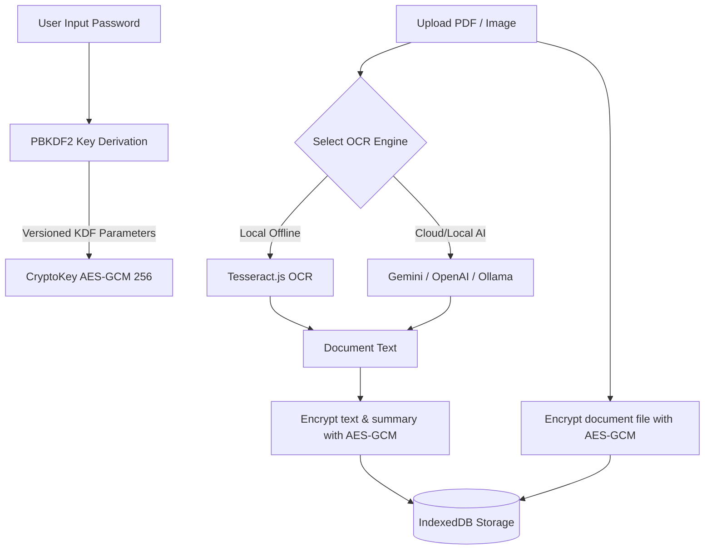

<div align="center">


# 👁️ OcularOCR

**A privacy-first, zero-knowledge local-encrypted document vault & AI-powered OCR suite.**

[](https://nextjs.org/)
[](https://react.dev/)
[](https://tailwindcss.com/)
[](https://www.gnu.org/licenses/gpl-3.0)

</div>

---

## 📖 Overview

**OcularOCR** is a Progressive Web App (PWA) designed to safely store, organize, and perform Optical Character Recognition (OCR) on your sensitive documents. 

Traditional OCR tools require uploading sensitive documents (invoices, tax forms, IDs) to remote servers. OcularOCR stores files and extracted data in a **local encrypted vault**: data is encrypted in your browser before it is written to IndexedDB. Local OCR keeps document content on the device. Cloud AI features are optional, require explicit consent, and send the selected page images or extracted text to the configured provider.

---

## ✨ Core Features

*   **🔒 Local Encrypted Vault**: Documents, metadata, tags, settings, and AI summaries are encrypted client-side using **AES-GCM (256-bit)** keys. New vaults use PBKDF2-SHA-256 with 600,000 iterations; existing vaults retain their versioned derivation settings for compatibility.
*   **🤖 Multi-Engine OCR & Vision**:
    *   **Cloud AI OCR**: Seamlessly integrates with **Google Gemini API** (utilizing fast, low-latency models like `gemini-3.5-flash` via the `@google/genai` SDK) and **OpenAI API** (`gpt-4o`).
    *   **Local AI OCR**: Configurable endpoint support for **Ollama** or custom local AI APIs (e.g., Groq) for fully self-hosted cloud extractions.
    *   **Offline Native OCR**: Bundles the Tesseract.js engine plus English and Indonesian models for OCR without a network connection. Additional language packs can be downloaded once and kept for offline use.
*   **🏷️ Hybrid Auto-Tagging & Categorization**:
    *   **Local Heuristics**: Lightweight rule-based tag matching on filename and document contents (Invoices, Receipts, Contracts, Passports, Statements, Manuals, Medical docs, etc.).
    *   **AI Auto-Tagging**: Uses structured JSON classification schema via configured LLMs.
*   **📝 Document Summarization**: Automatically generates structured markdown summaries and key extraction points from your documents.
*   **🎛️ Advanced AI settings**: Adjust generation temperature, set custom system prompts for OCR extraction or summarization, and choose your tag extraction strategies.
*   **🎨 Appearance Customization**: Native support for dark/light themes and customizable font sizing (small, medium, large) optimized for document reading.
*   **🚨 Self-Destruct Reset Mechanism**: One-click vault wipe option in settings to securely erase all IndexedDB collections, cryptographic salts, credentials, and cookies.
*   **📱 Progressive Web App (PWA)**: Install OcularOCR to your desktop or mobile home screen. The Offline OCR settings show readiness, prepare the app shell, and manage persistent language packs.
*   **📁 Smart Document Manager**: Search, filter, tag, and view your documents securely inside a unified, responsive dashboard.
*   **🛟 Reliability & Recovery**: Recoverable crash screens keep failures away from raw vault data, while storage diagnostics report quota pressure and browser cleanup protection before local data is at risk.

---

## 🛡️ Security Architecture

OcularOCR uses a strict **local-first, zero-knowledge** architecture:



1.  **Key Derivation**: When unlocking your vault, your password is put through a PBKDF2 derivation function with a cryptographic salt unique to your browser storage.
2.  **Encryption**: Documents, document metadata, tags, OCR results, settings, and summaries are encrypted with unique initialization vectors (IVs) and stored in `IndexedDB` via `idb-keyval`.
3.  **AI privacy boundary**: Local Tesseract OCR stays on-device. Remote AI OCR, tagging, cleanup, or summaries require explicit cloud-processing consent and send only the content needed for that operation to the configured provider.
4.  **On-the-Fly Decryption**: When viewing a document, the ciphertext is decrypted temporarily in browser memory. Locking the vault discards the crypto keys instantly.

---

## 🛠️ Tech Stack

*   **Framework**: Next.js 16 (App Router)
*   **Library**: React 19 (v19.2)
*   **Styling**: Tailwind CSS v4 (v4.3), Motion (Framer Motion)
*   **Icons**: Lucide React
*   **Database**: IndexedDB (using `idb-keyval` for lightweight promise-based storage)
*   **AI Integrations**: `@google/genai` (Gemini SDK), OpenAI API Client, Ollama compatibility
*   **Client-Side PDF Rendering**: `pdfjs-dist` & `jspdf`
*   **Client-Side OCR**: `tesseract.js`

---

## 🚀 Running Locally

### Prerequisites

Make sure you have [Node.js](https://nodejs.org/) installed (v18+ recommended).

### 1. Clone the repository
```bash
git clone https://github.com/LoLyeah/OcularOCR.git
cd OcularOCR
```

### 2. Install dependencies
```bash
npm install
```

### 3. Configure environment variables
Create a `.env.local` file in the root directory (you can copy [.env.example](file:///.env.example)):
```bash
# Set your Gemini API key for default AI OCR / Tagging / Summaries
GEMINI_API_KEY=your_gemini_api_key_here
```

### 4. Run the development server
```bash
npm run dev
```

Open [http://localhost:3000](http://localhost:3000) in your browser.

### 5. Build for Production
To build a highly optimized production bundle:
```bash
npm run build
npm run start
```

---

## 📦 Progressive Web App (PWA) Install

OcularOCR is configured to run as a Progressive Web App:
1. Open OcularOCR in a PWA-compatible browser (e.g., Chrome, Edge, Safari).
2. Click the **Install** button on the bottom prompt or the install icon in the browser address bar.
3. Once installed, OcularOCR will run in its own dedicated, distraction-free app window, caching essential code to work 100% offline.

---

## 📄 License

This project is licensed under the GNU General Public License v3.0 - see the [LICENSE](file:///Users/handi/Github/OcularOCR/LICENSE) file for details.
