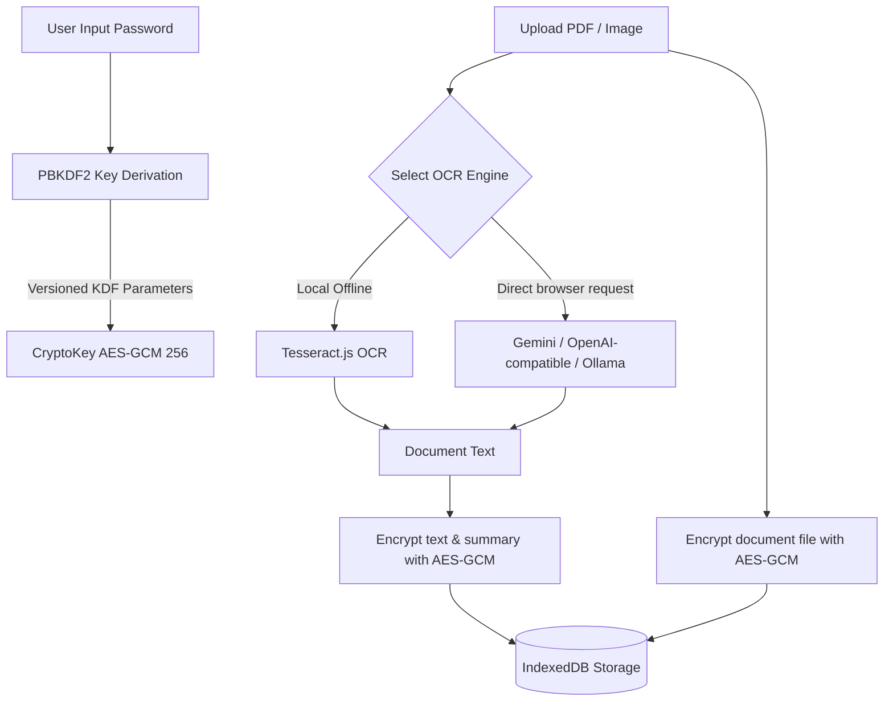

<div align="center">


# 👁️ OcularOCR

**A privacy-first, zero-knowledge local-encrypted document vault & AI-powered OCR suite.**

[](https://nextjs.org/)
[](https://react.dev/)
[](https://tailwindcss.com/)
[](https://www.gnu.org/licenses/gpl-3.0)

</div>

---

## 📖 Overview

**OcularOCR** is a Progressive Web App (PWA) designed to safely store, organize, and perform Optical Character Recognition (OCR) on your sensitive documents. 

Traditional OCR tools require uploading sensitive documents (invoices, tax forms, IDs) to remote servers. OcularOCR stores files and extracted data in a **local encrypted vault**: data is encrypted in your browser before it is written to IndexedDB. Local OCR keeps document content on the device. Cloud AI features are optional, require explicit consent, and send the selected page images or extracted text to the configured provider.

---

## ✨ Core Features

*   **🔒 Local Encrypted Vault**: Documents, metadata, tags, settings, and AI summaries are encrypted client-side using **AES-GCM (256-bit)** keys. New vaults use PBKDF2-SHA-256 with 600,000 iterations; existing vaults retain their versioned derivation settings for compatibility.
*   **🤖 Multi-Engine OCR & Vision**:
    *   **Cloud AI OCR**: Connects to Google Gemini or an OpenAI-compatible cloud endpoint after explicit consent.
    *   **Local AI OCR**: Connects directly from the browser to Ollama or another OpenAI-compatible endpoint running on the same device.
    *   **Capability checks**: Discovers available models where supported and uses tiny synthetic requests to verify text generation, image input, and structured JSON before document OCR.
    *   **Offline Native OCR**: Bundles the Tesseract.js engine plus English and Indonesian models for OCR without a network connection. Additional language packs can be downloaded once and kept for offline use.
*   **🏷️ Hybrid Auto-Tagging & Categorization**:
    *   **Local Heuristics**: Lightweight rule-based tag matching on filename and document contents (Invoices, Receipts, Contracts, Passports, Statements, Manuals, Medical docs, etc.).
    *   **AI Auto-Tagging**: Uses structured JSON classification schema via configured LLMs.
*   **📝 Document Summarization**: Automatically generates structured markdown summaries and key extraction points from your documents.
*   **🎛️ Advanced AI settings**: Adjust generation temperature, set custom system prompts for OCR extraction or summarization, and choose your tag extraction strategies.
*   **🎨 Appearance Customization**: Native support for dark/light themes and customizable font sizing (small, medium, large) optimized for document reading.
*   **🚨 Self-Destruct Reset Mechanism**: One-click vault wipe option in settings to securely erase all IndexedDB collections, cryptographic salts, credentials, and cookies.
*   **📱 Progressive Web App (PWA)**: Install OcularOCR to your desktop or mobile home screen. The Offline OCR settings show readiness, prepare the app shell, and manage persistent language packs.
*   **📁 Smart Document Manager**: Search, filter, tag, and view your documents securely inside a unified, responsive dashboard.
*   **🧰 Local PDF Workspace**: Merge PDFs, reorder or rotate pages, duplicate and delete pages, extract selections, undo edits, and save the result as a new encrypted PDF without modifying the originals.
*   **📐 Structured OCR & Rich Export**: Online and offline OCR share an editable, versioned document model for headings, paragraphs, lists, and tables. Export corrected structure to Markdown, reflowed or searchable PDF, DOCX, CSV, and JSON.
*   **🛟 Reliability & Recovery**: Recoverable crash screens keep failures away from raw vault data, while storage diagnostics report quota pressure and browser cleanup protection before local data is at risk.
*   **♿ Release Readiness**: Keyboard-safe dialogs, visible focus, skip navigation, reduced-motion support, accessible PDF reordering, and automated CI gates prepare the app for 1.0.

---

## 🗺️ Roadmap

The **1.0 Stable Release milestone** is implemented in the current development branch and awaits the explicit version bump. It adds launch security headers, encrypted-vault confirmation, browser preflight, mobile/PWA hardening, adaptive OCR resource limits, and final release documentation. See the [project roadmap](ROADMAP.md), [release candidate notes](RELEASE_NOTES.md), and [release checklist](docs/RELEASE_CHECKLIST.md).

---

## 🛡️ Security Architecture

OcularOCR uses a strict **local-first, zero-knowledge** architecture:



1.  **Key Derivation**: When unlocking your vault, your password is put through a PBKDF2 derivation function with a cryptographic salt unique to your browser storage.
2.  **Encryption**: Documents, document metadata, tags, OCR results, settings, and summaries are encrypted with unique initialization vectors (IVs) and stored in `IndexedDB` via `idb-keyval`.
3.  **AI privacy boundary**: Local Tesseract OCR stays on-device. Remote AI OCR, tagging, cleanup, or summaries require explicit cloud-processing consent and send only the content needed for that operation directly from the browser to the configured provider. API keys are encrypted at rest but decrypted in browser memory for those requests; there is no secret-hiding AI proxy.
4.  **On-the-Fly Decryption**: When viewing a document, the ciphertext is decrypted temporarily in browser memory. Locking the vault discards the crypto keys instantly.

---

## 🛠️ Tech Stack

*   **Framework**: Next.js 16 (App Router)
*   **Library**: React 19 (v19.2)
*   **Styling**: Tailwind CSS v4 (v4.3), Motion (Framer Motion)
*   **Icons**: Lucide React
*   **Database**: IndexedDB (using `idb-keyval` for lightweight promise-based storage)
*   **AI Integrations**: `@google/genai` (Gemini SDK), OpenAI-compatible Chat Completions, Ollama compatibility
*   **Client-Side PDF Rendering**: `pdfjs-dist` & `jspdf`
*   **Client-Side OCR**: `tesseract.js`

---

## AI Provider Setup

Provider settings are entered inside the encrypted vault under **Settings → AI Processing**. Model availability changes independently of OcularOCR, so the app treats these as dated examples and verifies the selected model against the connected account or server.

| Provider | Dated model example | Endpoint behavior | Official source |
| --- | --- | --- | --- |
| Google Gemini | `gemini-3.5-flash` | Remote Gemini API; API key required | [Gemini models](https://ai.google.dev/gemini-api/docs/models) |
| OpenAI-compatible | `gpt-5.6-luna` for OpenAI | Defaults to OpenAI; custom HTTPS-compatible endpoints are accepted | [OpenAI models](https://developers.openai.com/api/docs/models) |
| Ollama | `gemma3` | Local `localhost:11434`; use an installed vision model | [Ollama vision](https://docs.ollama.com/capabilities/vision) |

Examples and sources were reviewed on **2026-07-14**. Use **Test setup** to discover current models and verify text, vision, and structured-output support. If an example is unavailable to an account, select another returned model and test again.

### Support and freshness policy

- OcularOCR targets current releases of Chromium, Firefox, and Safari with IndexedDB, Web Crypto, Web Workers, and PDF.js support. Passkeys and persistent-storage protection remain browser-dependent.
- Encrypted vault and settings migrations preserve existing data; export an encrypted backup before upgrading or moving browser profiles.
- Provider model availability is not guaranteed. Curated examples carry a review date, the app discovers account-visible models, and a monthly automated check validates official documentation links.
- Experimental or provider-dependent behavior is labeled in the UI and must pass the capability test before AI OCR is enabled.

---

## 🚀 Running Locally

### Prerequisites

Make sure you have [Node.js](https://nodejs.org/) installed (v18+ recommended).

### 1. Clone the repository
```bash
git clone https://github.com/LoLyeah/OcularOCR.git
cd OcularOCR
```

### 2. Install dependencies
```bash
npm install
```

### 3. Run the development server
```bash
npm run dev
```

Open [http://localhost:3000](http://localhost:3000) in your browser.

### 4. Build for Production
To build a highly optimized production bundle:
```bash
npm run build
npm run start
```

---

## 📦 Progressive Web App (PWA) Install

OcularOCR is configured to run as a Progressive Web App:
1. Open OcularOCR in a PWA-compatible browser (e.g., Chrome, Edge, Safari).
2. Click the **Install** button on the bottom prompt or the install icon in the browser address bar.
3. Once installed, OcularOCR will run in its own dedicated, distraction-free app window, caching essential code to work 100% offline.

---

## 📄 License

This project is licensed under the GNU General Public License v3.0 - see the [LICENSE](LICENSE) file for details.
